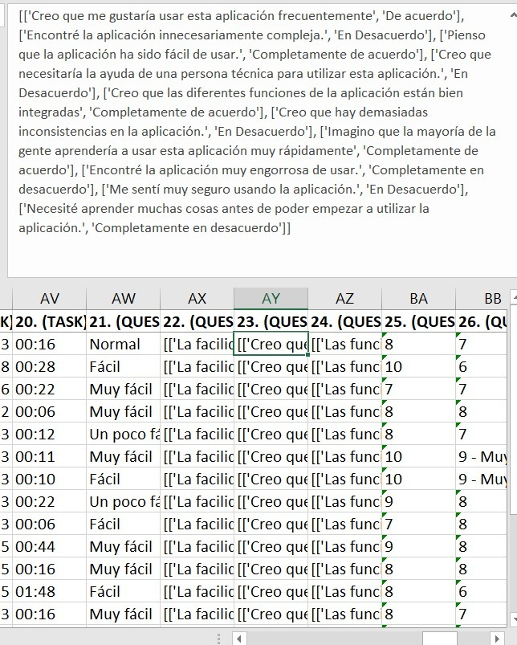
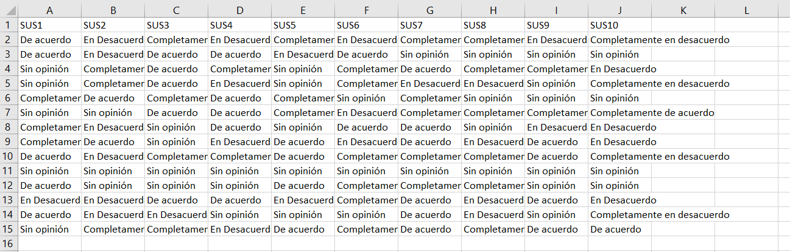
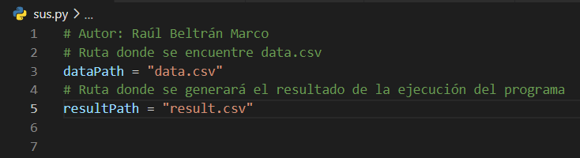

**Created by:** Raúl Beltrán Marco

**Contact:** raulbeltmarc@gmail.com

# sus.py  

`Proyecto para la asignatura GCS UA`

Es un proyecto pequeño que se encarga de procesar la columna correspondiente a las 10 columnas SUS.

Se realiza un procesamiento del texto y genera un .scv con el resultado deseado.

Para poder utilizarlo tan sólo será necesario tener Excel y Python(3) instalados

**ADVERTENCIA:** Sólo se ha probado en el sistema operativo de Windows

# Guía de uso

1) Abrir un nuevo **Libro en blanco** de Excel 
2) Abrir el excel `RawData` que ofrece Loop11
3) **Copiar la columna** correspondiente a la imagen de arriba (La que tiene todas las respuestas SUS)
4) **Pegar** dicha columna en el Libro en blanco creado en el paso **1**.
5) Realizar los siguientes pasos:
   - Archivo > Guardar como > Examinar
   - En el desplegable de Tipo elegir la opción de: `CSV (delimitado por comas)`
   - El archivo debe llamarse `data.csv`
   - Guardar el archivo en una ruta (Preferiblemente en la raíz de este proyecto para no tener que cambiar nada del código)
6) Ejecutar el programa con: `python sus.py`
7) Se generará en la raíz del proyecto un archivo llamado `result.csv` el cual podremos abrir con **Excel**

El resultado en cuestión deberá tener el siguiente formato que nos permitirá copiar y pegar estas 10 columnas en sus correspondientes 10 columnas con total facilidad.

## Cambiar rutas

En caso que quieras cambiar la ruta donde se genere el resultado o la ruta donde el programa obtiene el data.scv que se procesa entonces deberás cambiar las siguientes líneas del código:

